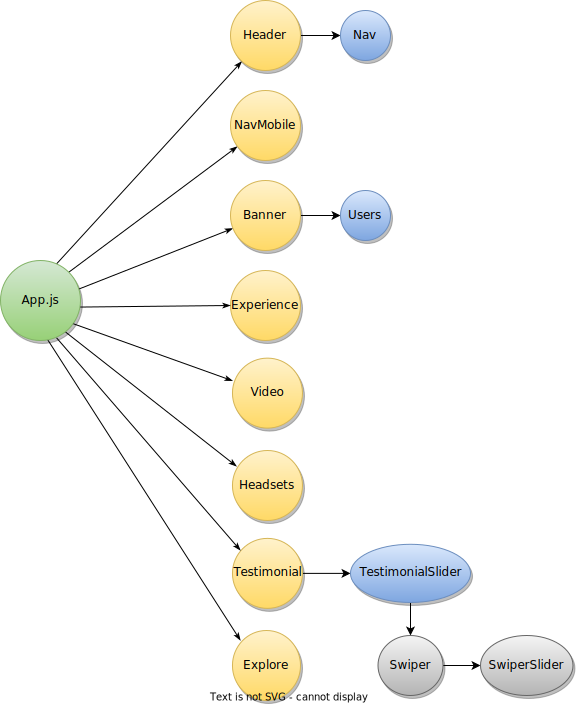

> 1 - Aug - 2022

## VR Landing Page | [Live Link](https://vr-page.netlify.app)

# React + TailwindCSS

## Learning context by developing this application:
* Custom Scroll Bar
* Image over text blur bg effect
* YouTube video modal component open
* Responsive Mobile Navigation Menu logic
* Using of Swiper Slider
    * Bullate Point | Pagination Color
    * Padding add parent slider for bullate position change
* AOS (Animation On Scrolling) 
    * AOS init by useEffect hook
    * set `data-aso` attribute at jsx elements

 

## Components Relationship, inside component tree...

 
    

